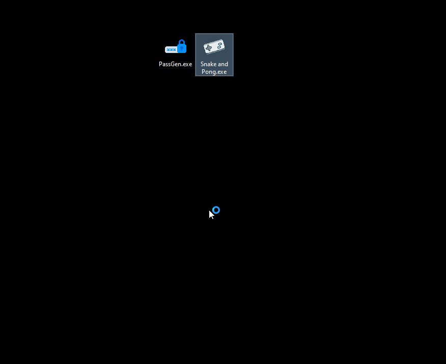

## Сборник игр 2 in 1 

Попытка создать сборник классических игр на библиотеке [Turtle](https://docs.python.org/3/library/turtle.html).



## Немного об играх

В игре Snake управление осуществляется клавишами ⬆⬇⬅➡.

В игре Pong левая планка управляется клавишами 🆆 - вверх, 🆂 - вниз. Управление левой
планкой осуществляется клавишами ⬆ и ⬇. Счет ведется до 10 очков, а скорость игры 
ускоряется при отбитии мяча.

### Небольшое пояснение

Код выполняется через блок try/except, это сделано специально, чтобы при запаковке в 
exe-файл и запуске на Windows, при закрытии программы не вылазило окно об ошибке. Код
выполняется в цикле и при закрытии приложения крестиком, цикл продолжает обращаться
к холсту, которого уже не существует.

<a href="https://imgbb.com/"></a>

## Установка

### Скачать

Python3 должен быть уже установлен.
[Скачать](https://github.com/Araime/snake_and_pong/archive/master.zip) этот репозиторий себе на компьютер.

Рекомендуется использовать [virtualenv/venv](https://docs.python.org/3/library/venv.html)
для изоляции проекта.

#### Быстрая настройка venv

Начиная с Python версии 3.3, виртуальное окружение идёт в комплекте в виде модуля
venv. Чтобы его установить и активировать нужно выполнить следующие действия в
командной строке:  

Указать скачанный репозиторий в качестве каталога.
```sh
cd C:\Users\ваш_пользователь\Downloads\папка_репозитория
```
Установить виртуальное окружение в выбранном каталоге.
```sh
Python -m venv venv
```
В репозитории появится папка виртуального окружения env  

<a href="https://imgbb.com/"></a>
Активировать виртуальное окружение.
```sh
venv\scripts\activate
```
Если всё сделано правильно, вы увидите в командной строке (env) слева от пути 
каталога.  

<a href="https://imgbb.com/"></a>

### Запуск

```sh
python snake_and_pong.py
```

## Запуск на Windows 10/11 pro как exe-файл

### Подготовка

Установите библиотеку [pyinstaller](https://pypi.org/project/pyinstaller/).

```sh
pip install pyinstaller
```

### Создание exe-файла

```sh
pyinstaller -w -F -i "game.ico" snake_and_pong.py -n "Snake and Pong"
```
После сборки exe-файла в корне репозитория создается папка dist, в которой будет
лежать готовое приложение.

## Цель проекта

Данный репозиторий создан с целью изучения возможности создания игр Python.
